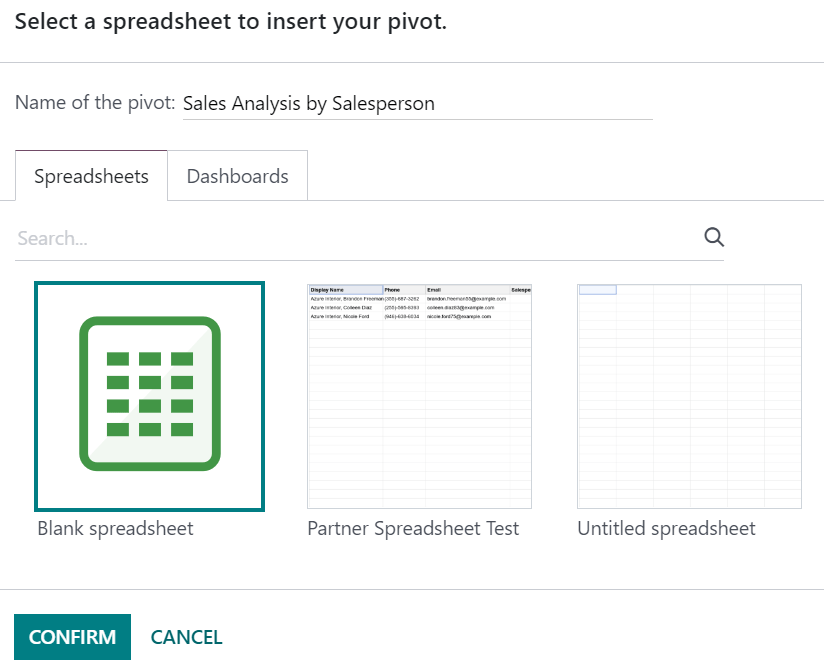

=================
Linking Odoo data
=================

You can insert and link several elements from your database in your spreadsheets:

- pivots,
- graphs,
- lists, and
- links to menus (i.e., a clickable link to a view of a specific model).

.. note::
   Before inserting :ref:`pivots <reporting/views/pivot>`, :ref:`graphs <reporting/views/graph>`, or
   lists, ensure they are tailored to your needs, as some elements are only or more easily
   configurable in their respective view.

To insert pivots and graphs, click :guilabel:`Insert in spreadsheet`. To insert a list, click
:menuselection:`Favorites --> Insert list in spreadsheet`. To insert a link to a menu, click
:menuselection:`Favorites --> Link menu in spreadsheet`.

Then, in the pop-up box, either create a new spreadsheet by selecting :guilabel:`Blank spreadsheet`
or insert it in an existing one by selecting it, then click :guilabel:`Confirm`.

.. note::
   By default, new spreadsheets are saved under the :guilabel:`Spreadsheet` workspace of the
   Documents app.

.. _insert/update:

Updating data
=============

Once inserted in a spreadsheet, your data is kept up-to-date, reflecting any changes made to your
database. For most intents and purposes, reopening the spreadsheet reloads the linked data.

.. note::
   To update pivots and lists data without reopening a spreadsheet, go to :menuselection:`Top bar:
   Data --> Refresh all data`.

Pivot data
----------

Whenever new cells should be added to a pivot, you need to go to :menuselection:`Top bar: Data -->
Re-insert pivot` to insert the new values. Alternatively, click :guilabel:`Insert pivot` instead,
select the pivot, and tick :guilabel:`Display missing cells only` to preview first which values
would be added.

   .. image:: insert/missing-cells.png
      :align: center
      :alt: Displaying missing cells in a pivot

To change which records are :ref:`measured in the pivot <search/preconfigured-filters>`, right-click
on a cell of the pivot, select :guilabel:`See pivot properties` and click :guilabel:`Edit domain`.
